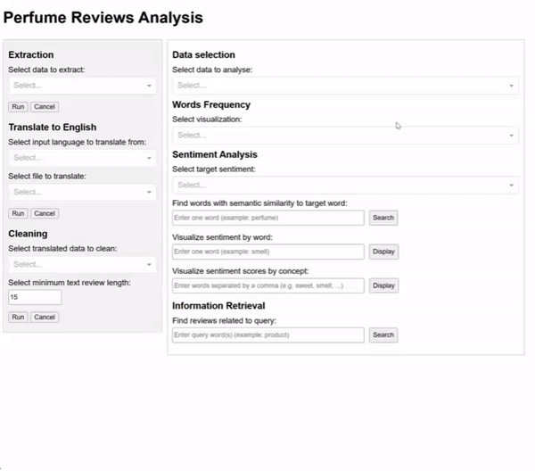

# Perfume Reviews Analysis - NLP, Dash App

Simple web application with NLP tools exploring the words frequency and sentiments from **20k+ reviews**
written by international customers for a famous perfume product (Lancôme). Reviews are first extracted and cleaned 
from eventual emojis, then translated in english e.g., from french, russian, chinese, italian, 
using the Marian translation models pre-trained by the **NLP group at the University of Helsinki** (available via the 
[Huggingface Hub](https://huggingface.co/docs/transformers/model_doc/marian)). Finally, the translated
reviews are individually (1) cleaned from e.g., special characters, emoticons and punctuations, (2) corrected 
by converting e.g. word abbreviations or contractions to normal wording, and (3) ruled out if duplicated in 
the reviews (spams). 

Application written with tools such as **Dash Plotly**, **Spacy**, **NLTK**, **Marian transformers** and **TextBlob**. Analytical
results are shown as graphs showing different insights, including frequency of concepts, importance of concepts by language,
and distribution of sentiment analysis by word, concept or sentence. The Dash app notably embeds a detailed 
pre-processing step of English-translated reviews, which is specific to perfume/product analysis. It emphasises
the exploration of words or concepts via sentiment analysis, semantic similarity analysis and information retrieval.

## Example of usage



## Environment
```
docker build -t dash_app .
docker run -p 8080:8080 dash_app
```
